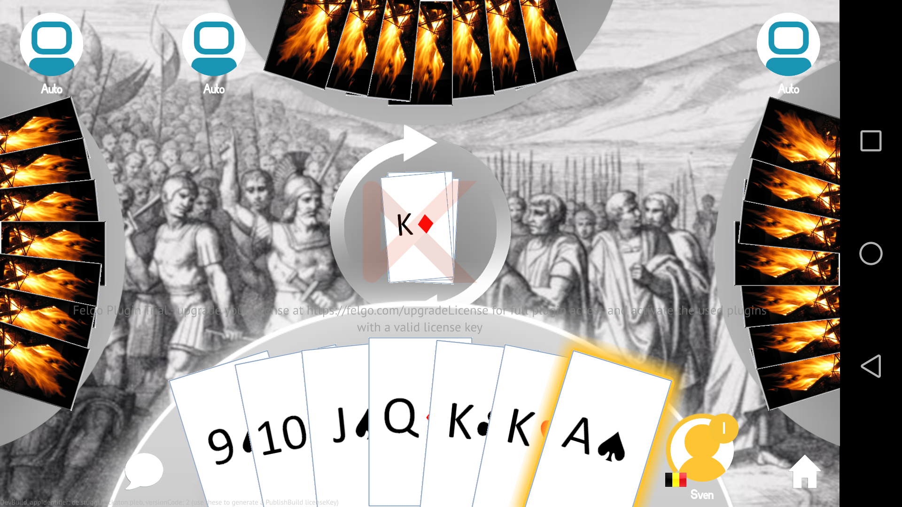
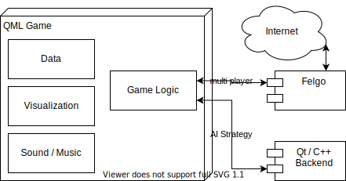

Copyright (c) 2020 Pleb-Team
Contact: stuggihackaton@gmail.com

# Pleb
A cooperative project to write a fancy cross platform card game with various AI styles.

# Table of Contents

1. [About](#about)
1. [Screenshots](#screenshots)
1. [Documentation](#documentation)
1. [Development](#development)
1. [Licenses](#licenses)

### About
Pleb is an implementation of the popular German card game **Arschloch** and English card game **President**. See at the [documentation](#documentation) for common rules.

It is based on the former Windows version [arschloch3d](https://sourceforge.net/projects/arschloch3d/) which uses [Direct3D](https://en.wikipedia.org/wiki/Direct3D).

### Screenshots
* Android:

* IOS:

### Documentation
* [Arschloch Rules](https://de.wikipedia.org/wiki/Arschloch_(Kartenspiel)) auf Deutsch
* [President Rules](https://en.wikipedia.org/wiki/President_(card_game)) in English

### Development
1. [Changes](#changes)
1. [ToDo](#todo)
1. [Architecture](#architecture)
1. [CI Continuous Integration](#CI)
1. [Dependencies](#dependencies)

#### Changes

#### ToDo
* use from Felgo independent multi-player cross platform system. Proposals:
    - [Google Play Game Services](https://developers.google.com/games/services/) - unfortunately deprecated

#### Architecture

(still early version of drawing, and [editable](https://app.diagrams.net/?mode=github)

#### CI
* with Felgo comes [Felgo Cloud](https://felgo.com/pricing) for individual developers that supports [android deployment](https://felgo.com/doc/felgo-deployment-android/)
* f-droid as deployment: [Publishing Nightly Builds](https://f-droid.org/de/docs/Publishing_Nightly_Builds/)

#### Dependencies
* [Felgo](https://felgo.com/): Multiplayer

### Licenses
* Pleb
    Licensed under GPLv3: [License](LICENSE)
    Copyright (c) 2020 Pleb-Team
* 3rd party software:
   * Felgo: [license](docs/licenses/FelgoLicense.txt)
   * Qt: [license](docs/licenses/Qt_LICENSE)
   * Other libraries and software used: [license](docs/licenses/ThirdPartySoftware_Listing.txt)
* Graphics:
   * Background image: "Secessione della plebe sul Monte Sacro" engraved by B. Barloccini, 1849. Downloaded from Wikipedia as [public domain](https://commons.wikimedia.org/wiki/File:Secessio_plebis.JPG).
* Sound/Music:
   * Music: [Bensound.com](https://www.bensound.com)
   * Sound: [freesound.org](https://www.freesound.org)

