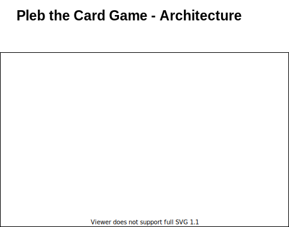

# Pleb
A cooperative project to write an android card game.

# Table of Contents
0. [Development](#development)
1. [Documentation](#documentation)
2. [Changes](#changes)
3. [ToDo](#todo)
4. [Architecture](#architecture)
5. [CI Continuous Integration](#CI)
6. [Goals](#goals)
7. [Dependencies](#dependencies)
8. [Issues](#issues)
9. [Yet in plan](#yet-in-plan)

### Development
* help with github changes on private email,  [remote: error: GH007: Your push would publish a private email address](https://www.masterdevops.eu/2019/04/14/git-error-gh007-your-push-would-publish-a-private-email-address/)

### Documentation

### Changes

### ToDo

### Architecture

(still early version of drawing, and directly [editable](https://www.draw.io/?mode=github))

### CI
* travis](https://travis-ci.org/) as release builder one day :grin:
* f-droid as deployment: [Publishing Nightly Builds](https://f-droid.org/de/docs/Publishing_Nightly_Builds/)

### Goals

### Dependencies

### Issues

### Yet in plan

